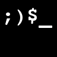

Terminal Faker
===========



An extensible pseudo-terminal in Javascript.

# What's this?
Terminal Faker is a Javascript, mobile-friendly, Linux-like terminal simulation for use in the browser. Originally forked from [AVGP/terminal.js](https://github.com/AVGP/terminal.js).

There is a [live demo here](https://syntaxseed.github.io/terminalfaker/).

You can do a bunch of things with it:

- Create a CLI-style API interface that runs in the browser.
- Create a remote terminal emulator for something that exposes an interface in a browser-consumable way (CORS, Websocket, WebRTC, ...).
- Create a text-based adventure game in the browser.
- Whatever you can come up with, where a command line interface is useful.

## How do I use it?
It's really easy:

1. You include the ``terminal.css`` and ``terminal.js`` files and have a container element (e.g. a div) with a child element holding a contenteditable element of class ``input`` and another span of class ``prompt`` with the actual prompt line you want to display.
2. You create an object with methods that will be your commands (see below for the details of how this works).
3. Call terminal.init and pass the container element, your commands object, and a callback which creates the custom prompt. - **Ready to roll!**

Here's a minimal example with one command:

```html
  <div id="terminal">
    <p id="intro">Type a command to get started.</p>
    <p class="hidden">
      <p id="boot">Type 'help' to get started.</p>
      <span class="prompt"></span>
      <span contenteditable="true" class="input"> </span>
    </p>
  </div>
  <script src="js/terminal.js"></script>
  <script>
    var commands = {};
    commands.cow = {
          about:  "What does the cow say?",
          exe:  function() {
            return "Moooooo!";
          }
    };

    // Set the command prompt style:
    var customPrompt = function () { return "guest@TerminalFaker $ ";};

    // Initialize the terminal:
    var term = Terminal.init(document.getElementById("terminal"), commands, customPrompt);
  </script>
```

## Extensible command interface

The terminal is only a way to interact with "commands" and "commands" are a bundles of functionality.
So to use the terminal, you'll need to create a bunch of functions that actually do something - and that's not hard.

First we modify our minimal example to load in the built-in commands and then extend them with custom commands defined in commands.js:

```html
  ...
  <script src="js/terminal.js"></script>
  <script src="js/system.js"></script>
  <script src="commands.js"></script>
  <script>
      // Extend the built-in system commands with the custom commands from commands.js.
      var commands = extendObject(builtInCommands, customCommands);
  ...
```

Then, in commands.js we will define custom commands (there are a couple examples in there already for you).

### A greeting command
So let's build a command that greets the user with the name she enters, like this:

```bash
$ hello Alice
Hi there, Alice
```

In commands.js this is done by creating a "customCommands" object and adding a "hello" object to it with an "about" property and a "exe" property.

"customCommands.hello.about" will contain a string of the help info to display if the user types ``help hello``.

"customCommands.hello.exe" will contain the closure to execute when the command is run. It can receive an "args" parameter which is an array of the command line arguments.

In this case, hello will take multiple arguments (separated by spaces), which will be passed into the command as the "args" array and returns HTML to be displayed in the terminal.

```javascript
var customCommands = {};
customCommands.hello = {
    about: "hello [arg ...]<br>&nbsp;&nbsp;Greet the user with a message.",
    exe: function (args) {                          // Executed for this command. args[0] contains the command name.
        if (args.length < 2) {
            return "Hello. Why don't you tell me your name?";
        }
        var name = "";
        // Concatenate all remaining arguments as the 'name'.
        for (var i = 1; i < args.length; i++) {
            name += args[i] + " ";
        }
        return "Hello " + name.trim();
    }
};
```

Note that the ``args`` array's first element is the name of the command itself.

That's it! Now the commands defined in commands.js will extend (and overwrite if re-defined) the built-in commands. We have a terminal that can greet the user :)

## Custom boot message

A boot up message can be simulated including delayed line-by line display of the boot text. This message is found in js/boot.js and is used by including the file *after* terminal.js is included. Your terminal div must contain an element with id of "boot".

```html
...
<script src="js/terminal.js"></script>
<script src="js/boot.js"></script>

Note that this will over-write any text already in the element with id "boot".
...
```
## Advanced Example


To see a full example including loading in system commands and the nicer boot message text, see the source of index.html.

## ToDo

* Basic filesystem.
* ls, cd, cat, touch, editing of files, mkdir, rmdir.

## Contributing
Pull requests are welcome. For major changes, please open an issue first to discuss what you would like to change.

## Authors

* **Sherri Wheeler** - *Author & Maintainer* - [SyntaxSeed](https://github.com/SyntaxSeed)
* **Martin Splitt** - *Based on his original Terminal.js* - [AVGP/terminal.js](https://github.com/AVGP/terminal.js)

## License
MIT License - basically: Do whatever you feel like, but don't sue me when it blows up.
