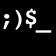
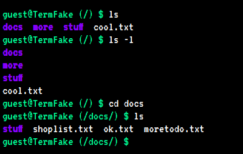
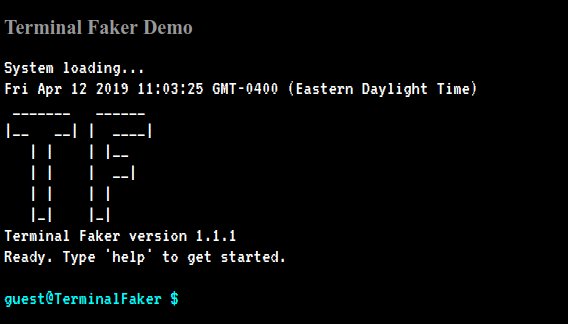

Terminal Faker
===========

<div align="center">
    
    
    <a href="https://twitter.com/intent/follow?screen_name=syntaxseed">
        </a>
</div>



An extensible pseudo-terminal in Javascript.

# What's this?

A pure Javascript, mobile-friendly, Linux-like terminal simulation for use in a browser. There is a **[live demo here](https://syntaxseed.github.io/terminalfaker/src/)**.

Originally forked from [AVGP/terminal.js](https://github.com/AVGP/terminal.js).

You can do a bunch of things with it:

- Create a CLI-style API interface that runs in the browser.
- Create a terminal emulator for something that exposes an interface in a browser-consumable way (CORS, Websocket, WebRTC, ...).
- Create a text-based adventure game in the browser.
- Create an educational tool for learning command line applications.
- Create a terminal style collection of docs.
- Etc.

## Features

- A terminal-like look and feel.
- Built in set of basic common commands.
- Autocomplete on commands and files/paths.
- Built in help for commands.
- Customizable boot message.
- Editable file of custom commands.

## How do I use it?

The easiest way to get started is to use the included "index.html" file and modify it for your needs. The basic usage is:

1. Include the "terminal.css" and the javascript files.
2. Have a container element (e.g. a div) with a child element holding a contenteditable element of class "input" and another span of class "prompt" with the actual prompt line you want to display.
3. Create an object with methods that will be your custom commands (see below for the details of how this works).
4. Include the minified bundle. - **Ready to roll!**

Here's a **minimal** example with one custom command:

```html
   <div id="terminal">
        <p class="hidden">
            <span class="prompt"></span>
           <span contenteditable="true" class="input" autocorrect="off" autocapitalize="none" autocomplete="off"> </span>
        </p>
    </div>

     <!-- Configuration -->
    <script>
        const TF_CONFIG_BOOT_LOADER = true;         // Whether to show the longer boot loading startup message.
        const TF_CONFIG_ELEMENT_ID = "terminal";    // Id of the Div to create the terminal in. Should be defined above.
    </script>

    <!-- Global Custom Definitions -->
    <script>
    var customCommands = {};
    customCommands.cow = {
            about:  "What does the cow say?",
            exe:  function() {
                return "Moooooo!";
            }
    };
    </script>

    <!-- Minified build -->
    <script src="js/bundle.min.js"></script>
```

## Extensible command interface

The terminal is only a way to interact with "commands" and "commands" are a bundles of functionality.
So to use the terminal, you'll need to create a bunch of functions that actually do something - and that's not hard.

First we modify our minimal example to load in custom commands found in "js/customCommands.js".

```html
  ...
    <!-- Global Custom Definitions -->
    <script src="js/customCommands.js"></script>
  ...
```

Then, in customCommands.js we will define custom commands (there are a couple examples in there already for you).

### A greeting command

So let's build a command that greets the user with the name she enters, like this:

```bash
$ hello Alice
Hi there, Alice
```

In customCommands.js this is done by creating a "customCommands" object and adding a "hello" object to it with an "about" property and a "exe" property.

"customCommands.hello.about" will contain a string of the help info to display if the user types ``help hello``.

"customCommands.hello.exe" will contain the closure to execute when the command is run. It can receive an "args" parameter which is an array of the command line arguments.

In this case, hello will take multiple arguments (separated by spaces), which will be passed into the command as the "args" array and returns HTML to be displayed in the terminal.

```javascript
var customCommands = {};
customCommands.hello = {
    about: "hello [name ...]<br>&nbsp;&nbsp;Greet the user with a message.",
    exe: function (args) {                          // Executed for this command. args[0] contains the command name.
        if (args.length < 2) {
            return "Hello. Why don't you tell me your name?";
        }
        var name = "";
        for (var i = 1; i < args.length; i++) {
            name += args[i] + " ";
        }
        return "Hello " + name.trim();
    }
};
```

Note that the "args" array's first element is the name of the command itself.

An optional attribute "hidden: true" can be added to a command definition to hide it from the list of commands shown by "help".

That's it! Now the commands defined in "commands.js" will extend (and overwrite if re-defined) the built-in commands. We have a terminal that can greet the user. :)

## Custom boot message

A boot up message is simulated including delayed line-by line display of the boot text. Your terminal div must contain an element with id of "boot". This message is found in "main/boot.js" and is included via WebPack. To customize this message you will need to rebuild the minified bundle with WebPack. If you don't want this, set the configuration variable: ``var TF_CONFIG_BOOT_LOADER = false; `` in your javascript.

Note that this will over-write any text already in the element with id "boot".

## A Mock Filesystem



A simulated filesystem is initialized from the default content found in main/filesystem.js. Basic navigation around the filesystem is available. You can edit this file to customize the contents, then rebuild with WebPack.

## Advanced Example



To see a full example including loading in system commands and the nicer boot message text, see the source of `index.html`.

## ToDo

* Basic filesystem (in progress).
* Editing of files, mkdir, rmdir, etc.
* See [GitHub issues](https://github.com/syntaxseed/terminalfaker/issues) page.

## Contributing

See the [Contributing Guide](CONTRIBUTING.md). Pull requests for existing issues are welcome. For other or major changes, please open an issue first to discuss what you would like to change.

### For Developers

Terminal Faker uses node packages, namely WebPack to create the minified JS bundle and to transpile the Javascript. When you first download the TerminalFaker source code, you must install the Node packages (make sure you have Node and NPM installed):

```bash
    npm install
```

If you have edited the Javascript files, build a new minified bundle with the following command:

```bash
    npm run build
```

To start `webpack` in watch mode run (automatically builds edited files):

```bash
    npm run build-dev
```

## Authors

* **Sherri Wheeler** - *Author & Maintainer* - [SyntaxSeed](https://github.com/SyntaxSeed)
* **Martin Splitt** - *Based on his original Terminal.js* - [AVGP/terminal.js](https://github.com/AVGP/terminal.js)

### Contributors

* **Ben Brunton** - [benbrunton](https://github.com/benbrunton)
* **Sahil Bondre** - [godcrampy](https://github.com/godcrampy)
* **LapinoLapidus** - [LapinoLapidus](https://github.com/LapinoLapidus)
* **Dzhamal Eziev** - [deziev](https://github.com/deziev)
* **Jacob Shu** - [jacob-shu](https://github.com/jacob-shu)

## License

MIT License - basically: Do whatever you feel like, but don't sue me when it blows up.
